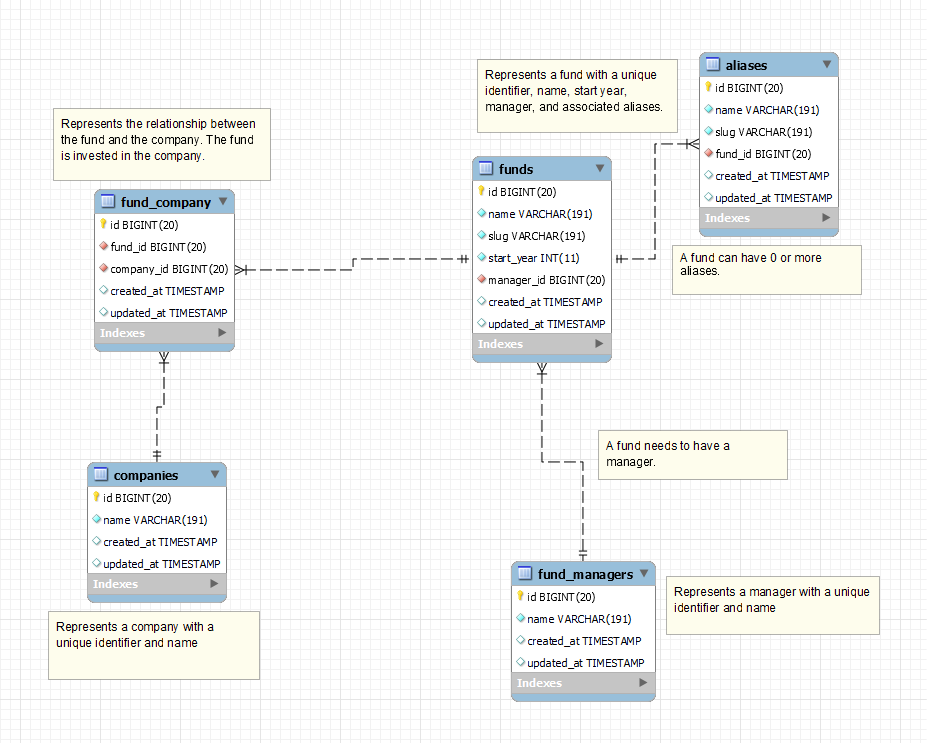

## About

This is a repository for the tech assessment for Canoe Intelligence

## How to build

This project is on top of a Laravel application. If you are not familiar with Laravel, you can check their docs:
- [Laravel Documentation](https://laravel.com/docs/10.x/installation)

## Initial requirements

For running your environment you will need at least `PHP >= 8.1`, `Composer` and a database (we use `MySQL`) to start with. Depending on the operating system that you are running, there are multiple ways to install all three. We recommend taking a look at the following links to get started: [PHP Installation](https://www.php.net/manual/en/install.php), [Composer Installation](https://getcomposer.org/download/), [MySQL Installation](https://dev.mysql.com/doc/refman/8.0/en/installing.html).

After installing everything, make sure they are correctly working by running:
```Bash
php --version   

PHP 8.1.2 (cli) (built: Jan 24 2022 10:42:51) (NTS)
Copyright (c) The PHP Group
Zend Engine v4.1.2, Copyright (c) Zend Technologies
    with Zend OPcache v8.1.2, Copyright (c), by Zend Technologies
    with Xdebug v3.1.2, Copyright (c) 2002-2021, by Derick Rethans
```

```Bash
composer --version    
       
Composer version 2.2.5 2022-01-21 17:25:52
```
```
mysql --version

mysql  Ver 8.0.27-0ubuntu0.21.04.1 for Linux on x86_64 ((Ubuntu))
```

### Installing dependencies & Configurations

```Bash
composer install
cp .env.example .env
php artisan key:generate
```

## Docker

This project contains a docker configuration to make it easier to run it.

To run the docker and keep the process open, displaying logs:
```bash
docker-compose up
```

To run in the background, not displaying logs:
```bash
docker-compose up -d
```

```bash
docker-compose ps
NAME                         IMAGE                    COMMAND                  SERVICE             CREATED             STATUS                    PORTS
canoe-test-canoe.laravel-1   sail-8.1/app             "start-container"        canoe.laravel       xxxxxxxxxxxxxx      xxxxxxxxxxxxxx             0.0.0.0:80->80/tcp, 8000/tcp
canoe-test-canoe.mysql-1     mysql/mysql-server:8.0   "/entrypoint.sh mysq…"   canoe.mysql         xxxxxxxxxxxxxx      xxxxxxxxxxxxxx (healthy)   0.0.0.0:3306->3306/tcp, 33060-33061/tcp
canoe-test-canoe.redis-1     redis:alpine             "docker-entrypoint.s…"   canoe.redis         xxxxxxxxxxxxxx      xxxxxxxxxxxxxx             0.0.0.0:6379->6379/tcp
```

## Database & Migration

### ER DIAGRAM



### Configuration

Configure your database credentials in the .env file
````.dotenv
DB_DATABASE=canoe_test
DB_USERNAME=******
DB_PASSWORD=******
````

After the database is running, you need to run:

```bash
docker exec canoe-test-canoe.laravel-1  /var/www/html/artisan migrate
``` 
Or
```bash
docker exec -it canoe-test-canoe.laravel-1 bash
cd /var/www/html
php artisan migrate
```
Output
```bash
   INFO  Preparing database.

  Creating migration table ......................................... 58ms DONE

   INFO  Running migrations.  

  2019_12_14_000001_create_personal_access_tokens_table ............ 70ms DONE
  2023_08_21_225121_create_companies_table ......................... 16ms DONE
  2023_08_21_225233_create_fund_managers_table ..................... 29ms DONE
  2023_08_21_225246_create_funds_table ............................. 94ms DONE
  2023_08_21_225329_create_aliases_table ........................... 59ms DONE
  2023_08_21_225352_create_fund_company_table ..................... 115ms DONE
```
## How to serve

If everything went ok, the project should already be running.
Check localhost

### Testing

#### Laravel testing

This project has a few test for funds
```Bash
php artisan test

   PASS  Tests\Feature\FundControllerTest
  ✓ can get all funds                                                                                                                                                                                                        0.53s  
  ✓ can create fund                                                                                                                                                                                                          0.04s  
  ✓ can create fund with alias                                                                                                                                                                                               0.04s  
  ✓ can return duplicated funds                                                                                                                                                                                              0.06s  

  Tests:    4 passed (11 assertions)
  Duration: 0.81s

```

#### Normal testing

There is a [Canoe Test.postman_collection.json](Canoe%20Test.postman_collection.json) included in the project, import this in postman and all the queries are already written
